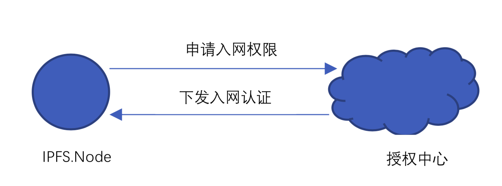

[TOC]

## 本体存储场景分析

### 本体底层系统的存储场景

```
当前本底层主要存储一下三种类型的数据：
1. 存储本体区块数据及交易数据
	当前本体底层涉及了三个leveldb库，分别用于存储共识后的数据内容，包括区块数据、状态数据、事件数据；

2. 存储log数据；
	系统运行过程中，为了很好的记录本体的运行状态、追踪系统运行中存在的异常，需要记录大量的log日志；

3. 用户钱包数据
	相较于中心化的系统，用户的个人账户信息都是存放在中央服务器，用户不用承担个人基本信息管理；而区块链系统是完全去中心化的分布式系统，每个用户独立管理自己的账户文件(即钱包文件)；

```

### 本体应用生态里的存储场景

```
1. 生态内的应用数据(To B)
	1.1 视频数据，此处的视频数据主要面向这几个特点：海量、读写频次较低；
		例如：交通监控数据、大厦安保监控数据、大数据分析公司原始数据等；
	1.2 音频数据，此类数据数据的特点和视频数据类似：海量、读写频次低；
		例如：保险回访录音数据、影视前期配音数据等；
	1.3 图片数据
	1.4 文本数据，例如医院医疗影像数据、电子合同数据等
	
2. 用户数据 (To C)
	2.1 普通的文本数据，例如一个本地文档
	2.2 小型的媒体数据，例如音乐、电影、图片等
```

### 当前区块链行业中的存储现状

```
1. 通过全网节点相互数据冗余，增加了数据的安全性；但是也增加了资源开销；
2. 在数据量较少的情况下，各个节点可以提供很好的存储支撑；当系统运行时间过长，积累了大量的数据后，数据的存储压力将会是各个节点的重要痛点之一；
```


## 本体存储系统需求

### 数据存储能力描述

```
1. 存储本体底层区块数据及交易数据；存储本体生态上层应用数据；
2. 支持存储的数据类型，包括普通的字符串数据、json格式的对象数据、流媒体数据、大文本数据等；
3. 支持普通用户及企业级用户的多样化存储需求；
4. 支持海量的存储规模
5. 读取响应能力要求一般
```


### 存储网络可控性描述

```
1. 本体存储网络，是一个分布式存储系统；针对这样一个分布式系统，对于加入的节点是有限制的；不会像公链一般可以随意加入退出；
2. 对于即将加入和退出的存储节点，都有相应的流程限制；
```


### 数据安全性描述

```
1. 参与存储的服务节点，会在一定时间内提供可靠的服务；当服务到期，需要对数据做快照备份，并通知网络；
2. 对于存储的数据内容，系统应提供完善的数据加密功能，不建议明文存储；
```


### 数据可靠性描述

```
1. 写入本体存储系统的数据，不可以被存储节点删除，通过引入检查节点的方式，定时的对存储节点做持有性证明；
2. 当用户误删部分存储数据时，系统应提供一种证明机制，保证数据的可恢复性；
```


### 系统易用性描述

```
1. 从写入角度描述
	用户写入时，后面的存储实现对用户完全透明，只需要通过简单的、统一的写接口完成；
2. 从读取角度描述
	用户读取的时候，后端的存储实现同样是透明；
	针对同一个文件，在用户做了修改行为后再次读取，用户的读操作不需要做同步调整；(例如IPFS里面提供 IPNS机制)
```


### 经济模型描述

```
1. 用户的存储需求，需要伴随一定的ONG支出；
2. 对于加入存储网络的节点，在参与存储的过程中，会有一定的ONG分成收益；
```


## 建议解决方案

### 综述

```
经过调研市场常见的点对点分布式存储系统，例如Siacoin、IPFS、Storj、MaidSafe......，基于如下几点比对分析：
1. 存储系统的行业影响力
2. 存储系统的社区生态及技术栈
3. 系统面向的存储领域(有的是面向个人，有的是面向企业)
4. 存储系统的团队支持能力
最终我们决定基于IPFS给出一个初步的本体存储解决方案；
```

### 方案实施过程

1. 在网络节点安全方面

   ```
   1. 引入存储节点质押机制，对于加入该存储网络的节点需要提前质押相应token；以此防止恶意退出；
   2. 引入中央授权服务器，需要加入存储网络的节点，应提前获得中央节点的认证授权；
      各个节点在网络连通前，需要互相确认身份；
   3. 引入节点数据定时备份机制，防止节点到期下线后数据丢失的问题；
   ```

2. 在数据安全及可靠性方面

   ```
   1. 引入数据持有性证明机制；
   2. 引入检查节点，定期检查节点数据是否满足完备性；
   3. 引入存储质押机制；
   ```

3. 在经济模型方面

   3.1 存储节点质押

   ```
   a. ontology内置质押native合约；加入IPFS私有存储网络的节点，通过该合约质押ONG；
   b. 定期触发native存储合约，如果恶意退出，执行扣款；
   c. 定期触发native存储合约，如果节点运行良好，当存储到期后，执行结算功能；
   ```

   3.2  用户付费

   ```
   a. ontology内置用户存储合约；
   b. 当用户发起存储请求时，付费模型有如下几种可能：
     b.1 一次性固定收费；例如：存储一次收取N个ONG；
     b.2 按照用户的存储容量进行收费；
     b.3 按照用户的存储时长和存储容量，进行收费；
     b.4 进一步考虑，当用户数据有丢失的时候，进行赔付；
   ```

   

4. 存储网络构建过程

   4.1 获得权限流程

   

   4.2 加入流程

   

   4.3 完整网络模型

   


## 论证分布式存储的必要性


## 论证分布式存储的可行性

