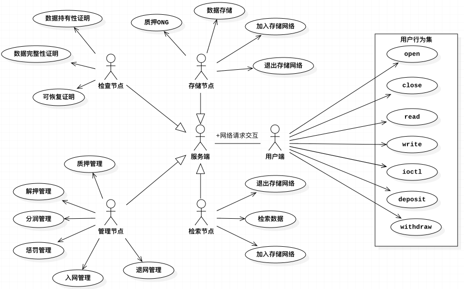
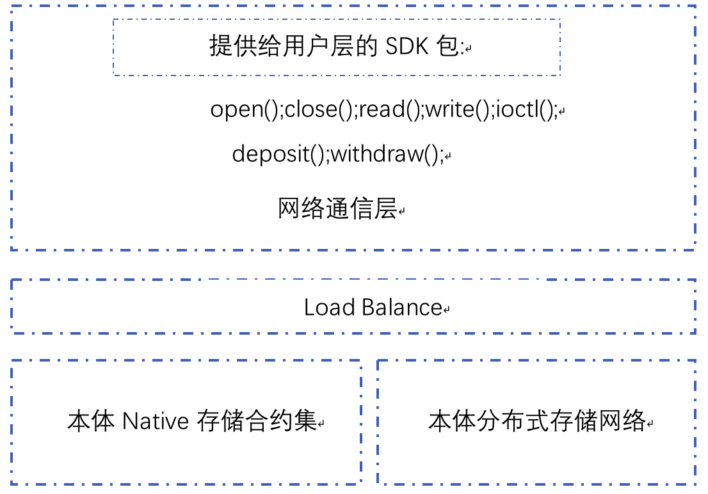

[TOC]

## 存储场景分析

### 本体生态内存储场景

```
本体是新一代公有基础链项目，致力于构建一个分布式信任协作平台；基于这样的愿景，在可预见的未来，本体生态内可能会存在的数据场景包括如下几部分：
1. 多方安全计算场景；
	针对多方安全计算的场景，为了保证待计算数据的安全性、中立性和快速共享，本体需要有一个去中心化的存储系统；
2. KYC场景；
	对于KYC数据，KYC数据的参与方，同样也会有数据中立性和安全性的诉求；
3. smartx场景；
	smartx是本体团队为智能合约开发者提供的可视化WEB开发工具，目前通过smartx工具产生的智能合约代码，全部是存储于中心化服务器的；这种架构部署违背了区块链产品去中心化的特性；一旦中心化存储服务器出现故障，将会导致智能合约文件获取失败；
4. 其他数据协作场景
```

### ONTO内存储场景

```
ONTO是基于本体的综合客户端产品，是本体信任搜索引擎和区块链体系的入口。ONTO将帮助用户实现包括数字身份管理、数字资产管理、分布式数据交换等综合性功能。
在产品实施的过程中，会围绕如下几种场景产生用户数据：

1. 用户通过ONTO创建数字身份，为了尊重保护用户的数据隐私，数字身份信息将交由终端用户保存备份；

2. 用户通过ONTO创建数字钱包，该数字钱包私钥文件及相关的助记录词都需要用户在终端自主备份；

3. 通过ONTO产生的身份认证数据，例如：CFCA、ZCX等认证数据，目前都是交由终端用户自主保存；

4. 通过ONTO产生的社交证明信息，例如github、twitter、facebook等社交认证，目前是交由终端用户自主保存；

以上几类用户数据，通过数据归属权的下放，保证了数据安全性；由于每一类用户隐私数据都将管理权限释放给用户，也给用户管理自身数据带来了很大的麻烦；例如数据的备份、转移、同步；
因此，从产品的易用性和人性化的角度，为ONTO用户提供一个去中心的可辨识的分布式存储系统，是一个很有必要的举措；
```


### 区块链系统的存储弊端

>区块链自2009年起，发展至今已有近10年时间；10年间，出现了以比特币、以太坊为代表的第一代及第二代区块链系统；基于区块链去中心化、节点对等、防篡改的特性，每一个区块链节点，都存储了全网的数据内容；这种数据存储处理策略，在系统早期是没有什么问题的。但随着时间的推移，由于每个节点的数据只增不减，节点存储的数据量变得越来越庞大，很多问题也将浮出水面；

下面我们将以比特币和以太坊为例，分析区块链上的数据可能存在的弊端；

```
1. 两个系统自上线之日起，均积累了大量的数据；截止目前，以太坊已经超过了300GB，比特币已经超过了180GB；基于区块链系统的去中心化、防篡改的特性，每一个加入比特币或者以太坊的全节点，都将保有全网数据；随着时间的增长，区块链上的存储数据也会呈线性增长，这无疑会给部分节点带来很大存储压力；

2. 每一个新加入的系统节点，都需要做全网的数据同步，以保证数据的公正性和不可篡改性；但是，当系统运行很长时间积累海量区块数据后，区块同步将会给节点的冷启动，带来巨大时间压力；同时，使得系统的网络开销陡增；

3. 基于2/8原则，最近20%的区块数据的使用频次是最高的；而较旧的数据，随着时间的推移，系统对其使用的依赖性会越来越低，这极大的降低了存储硬盘的有效利用率；

4. 系统运营及统计分析，是区块链里非常重要的一环；在这种场景下，对数据的获取将远大于数据的持有；因此，对于运营分析，非常迫切需要有一个公开的统一的数据源；

5. 从区块链存储的数据类型来看，目前只能存储简单的交易类型数据；在存证场景下，一旦遇到流媒体文件、大文本文件时，区块链在数据存储上就变得非常被动；

以上是经典区块链系统的数据特点；同样的，这些数据存储及使用问题，在可预见的未来，ONT同样也会面对；因此，设计并实现一个分布式的、去中心化的、数据共享的存储系统，非常有必要；
```


## 本体存储系统需求

### 业务需求描述

> 1. 用户可以通过ONTO客户端，一键保存数字身份信息至分布式存储系统，例如ONTO-ID；
> 2. 用户可以通过ONTO客户端，一键保存身份认证报告数据至分布式存储系统，例如CFCA，ZCX等数据；
> 3. 用户可以通过ONTO客户端，一键保存社交报告数据至分布式存储系统，例如Github、Twitter、Facebook等；
> 4. 用户可以通过ONTO客户端，一键获取存储于分布式存储中的数字身份信息，例如ONTO-ID；
> 5. 用户可以通过ONTO客户端，一键获取存储于分布式存储中的身份认证报告数据，例如CFCA，ZCX等数据；
> 6. 用户可以通过ONTO客户端，一键获取存储于分布式存储中的社交报告数据，例如Github、Twitter、Facebook等；
> 7. 用户通过ONTO客户端，查看剩余存储`流量`展示；
> 8. 用户通过ONTO客户端，查看已用存储`流量`展示；
> 9. 用户通过ONTO客户端，查看分布式存储系统中的数据列表；
> 10. 用户通过ONTO客户端，以ONG为计价标准，购买分布式存储空间；
> 11. 用户将KYC数据，通过`WEB`端，提交至分布式存储系统；
> 12. 用户通过`WEB`端，获得已经提交至分布式存储系统的KYC数据；
> 13. 用户将多方计算数据，通过`WEB`端，提交至分布式存储系统；
> 14. 用户通过`WEB`端，获得已经提交至分布式存储系统的多方计算数据；
> 15. 用户通过smartx客户端，一键保存smart code至分布式存储系统；
> 16. 用户通过smartx客户端，一键保存chain code至分布式存储系统；
> 17. 用户通过smartx客户端，查看已经保存在分布式存储系统中的smart-code及chain-code；
> 18. 用户通过smartx客户端，获得已经保存在分布式存储系统中的smart-code及chain-code；
> 19. 用户通过smartx客户端，保存已经`修改`的smart code至分布式存储系统；


### 功能需求描述

```
功能需求，从大的角度来看，可以拆分成四个维度：
a. 增加数据
b. 删除数据
c. 查询数据
d. 流量计费
e. 质押/解压ONG
```

1. 提供buyDataFlow功能，支持用户通过ONG购买存取流量需求；
2. 内置Native存储合约，支持存储流量计费能力；
3. 提供查看已使用流量和剩余流量的功能；
4. 提供获取特定用户某个数据的功能；
5. 提供获取特定用户全部数据的功能；
6. 提供将特定数据写入分布式存储的功能；
7. 提供删除特定数据的功能；(针对更新操作，可以看成是`删除+写入`)
8. 针对节点用户，提供质押ONG功能；
9. 针对节点用户，提供解压ONG功能；


### 性能需求描述

`读取响应速度`

```
以256K数据为基准，针对一个完整的响应周期（包括读写请求、读写完成、结果返回），将时间控制在1毫秒以内；
```

`TPS需求描述`

```
a). 单存储节点，TPS达到每秒百兆级写入；
b). 随着存储节点增加，整体TPS性能线性提升；
c). 当线性提升存储节点数量时，单节点性能损耗控制在20%以内；
```

`存储容量描述`

```
a). 针对普通用户，每个用户每年可使用的存储流量上限为500G；
b). 针对特殊用户，每年可使用的存储流量上限为10T；
c). 通过native合约，设置特殊用户；
```

`数据安全性保证`

```
a). 分布式存储系统会对写入的数据，进行二次加密，保证密文存储；
b). 由于存储节点会有到期下线的可能，系统应该具备备份复制功能，保证数据不会因节点下线而丢失；
```

`数据可靠性保证`

```
a). 系统应该具备数据持有性证明机制，证明某个节点真的存储了数据，或者证明某个数据真的被存储成功；
b). 系统应该具备数据完整性证明机制，证明某个数据被完全存储，而不是部分存储；
c). 系统应该具备数据可恢复性证明机制，当已经被存储的数据部分丢失的时候，可以通过该机制实现数据全量恢复；
d). 系统应该具有检查节点，综合上述三种机制，保证分布式存储的数据可靠性；
```

`存储网络安全性保证`

```
1. 通过native合约，约束存储节点的加入流程；
2. 通过native合约，约束存储节点的退出流程；
3. 对于加入存储网络的节点，应该提前进行ONG代币质押；当该节点在存储周期内，无法提供稳定的存储服务时候，将触发native惩罚合约；
```


## 建议解决方案

### 综述

```
在中心化的存储方案中，我们可以明显的发现：
1).这种方案极大的破坏了数据的隐私性和安全性；
2).针对读取需求不高的数据，中心化的存储方案，极大降低了存储介质的有效利用率，带来了存储资源的浪费；
3).与此同时，中心化存储方案，伴有严重的数据操控嫌疑；
相较于此，分布式存储方案，可以完全避免上述的存储弊端；此外，当分布式存储网络，达到一定的系统规模，将会极大的提高网络分发的效率；同时提高系统的健壮性；
```


### 技术路线调研

```
此次调研，我们主要分析了IPFS、StorJ、Genaro、Siacoin、MaidSafe、Burstcoin 6款分布式存储方案，并从产品特性、产品技术栈、产品趋势图及产品社区活跃度四个维度做了比对，详情如下所示：
```

#### 产品特性

|   项目    |                   Features                    |
| :-------: | :-------------------------------------------: |
|   ipfs    | 内容可寻址、版本化、点对点超媒体的分布式协议  |
|   storj   | 去中心化、端到端加密、可持续的云存储，B端市场 |
|  Genaro   |        图灵计算完备的去中心化存储网络         |
|  siacoin  |               去中心化存储平台                |
| MaidSafe  |         自治理、去中心分布式存储网络          |
| Burstcoin |          基于容量证明的去中心化存储           |

#### 产品技术栈

|   项目    |  language  |
| :-------: | :--------: |
|   ipfs    |     Go     |
|   storj   | Javascript |
|  Genaro   | Javascript |
|  siacoin  |     Go     |
| MaidSafe  |  Rust/C++  |
| Burstcoin |    Java    |

#### 产品趋势分布


#### 代码活跃度

|     项目      | issues | watch | star | fork | commits |
| :-----------: | :----: | :---: | :--: | :--: | :-----: |
| ipfs/filecoin |  817   |  427  | 5.5K | 965  |  8616   |
|     storj     |   51   |  99   | 461  | 114  |  1246   |
|    Genaro     |   0    |  18   |  26  |  6   |   276   |
|    siacoin    |  122   |  322  | 2.6K | 413  |  8912   |
|   MaidSafe    |   14   |  143  | 592  | 110  |  1791   |
|   Burstcoin   |   24   |  67   | 181  | 147  |  2125   |


#### 总结

```
针对以上的6种分布式存储产品的比对和本体对分布式存储的需求，我们决定基于IPFS+Ontology构建一个适用于本体生态的安全可信的、分布式存储系统；
```


### 存储网络方案设计思路

#### 0. 本体当前的存储现状

```
1. 启动时，创世块的判断和构建；
2. ont落块时，写block；
3. 
```


#### 1.系统基本角色抽象

```
基于以上的需求分析，我们抽象出了五类系统角色：
1. 用户端：读写请求发起方；
2. 存储节点：承担用户的写数据请求；
3. 检索节点：承担接收用户的读数据请求；
4. 监察节点：通过周期性的触发数据完整性证明机制、数据持有性证明机制，保证数据的存储有效性；
5. 管理节点；由Ontology底层公链承担；通过内置Native存储合约完成；负责存储网络的构建(节点加入、退出)，存储分润，节点惩罚，数据备份；

存取用户，我们视为一类大角色；检查节点、存储节点、检索节点、检查节点、管理节点，相对于用户层统一的抽象成服务端；这样，我们便构建出了一个C/S架构的系统；
下面给出一个粗略的系统用例图：
```




#### 2.系统基本行为抽象

2.1 基于用户视觉，我们将服务端视为一个对用户透明的逻辑`文件`，这样便可以抽象出用户的基本行为：

1. open()；
2. close()；
3. read()；
4. write()；
5. ioctl()；
6. buyDataFlow()；

这些基本行为，将统一封装在前端SDK中；下面将对以上6种基本行为逐一展开说明：

`open()说明`

```
用户端在执行读写操作之前，open行为是必须的操作；open操作的内部主要做两件事，分别是：
1. 用户权限检查；
2. 读写预处理、预准备；
```

`close()说明`

```
当用户读写操及control操作完成且不再有后续操作时，调用close()操作；close()操作也会做两类事，分别是：
1. 释放本地的系统资源；
2. 通知远端存储网络本次数据操作结束，可以做相应资源释放；
```

`read()说明`

```
1. 形式： read(key);
2. 按照Key值，获得用户所需的数据；
3. 解密从存储网络返回的数据；
```

`write()说明`

```
1. 形式：write(data)；
2. 将数据写入存储网络；
3. 加密即将写入存储网络的数据；
```

`ioctl()说明`

```
ioctl操作，包含了用户的两种可能行为：update数据和delete数据；
```

`buyDataFlow()说明`

```
通过buyDataFlow()操作，用户向存储网络支付ONG，购买读写流量；
```


2.2 基于后端存储网络这个角度分析，可以抽象出的系统基本行为是：

1. deposit()；
2. withdraw()；
3. put()；
4. get()；
5. manager()；
6. monitor()；

`deposit()说明`

```
1. 存储节点行为；
2. 存储节点，通过质押ONG保证可以在服务周期内，提供稳定的存储服务；
3. ONG质押数量和提供的服务时长及存储容量都有关系；
```

`withdraw()说明`

```
1. 存储节点行为；
2. 存储节点在服务周期结束后，可以选择退出存储网络，退出行为即通过withdraw操作完成；
3. 在withdraw时，要完成本存储节点的结算；
4. 在withdraw时，系统要完成对本节点的数据备份；
```

`put()说明`

```
1. 存储节点行为；
2. 存储网络通过底层IPFS，将文件打散后分发至各个存储节点；
3. 扣除前端用户的流量；
4. 向各个存储节点，按流量预支付ONG；
```

`get()说明`

```
1. 检索节点行为；
2. 存储网络通过底层IPFS网络，获得分散的文件Block，并封装成完整的文件返回至前端；
```

`manager()说明`

```
1. 管理节点行为；
2. 针对当前系统，管理节点即本体公链上的Native合约集；
3. 具体管理内容，查看下一节(系统结构初步拆分)中的的Native合约集说明；
```

`monitor()说明`

```
1. 检查节点行为；
2. 定期进行，数据持有性证明；
3. 定期进行数据完整性证明；
4. 证明结果入链，等待系统结算的时候用；
5. 检查存储节点在线状态；
```


#### 3. 存储网络生命周期描述

1. DSN.Setup()

```
1.1 通过共识管理合约判断是否具有质押资格；通过这一步保证了，只有共识网络可以参与到本体的分布式存储网络；
1.2 具有质押资格后，进行存储质押；
质押成功后，NodeID、质押金额、质押时间、服务周期等这些信息将会存储到链上；
1.3 存储网络也应该有seedlist；所有节点先连接到seedlist；
1.4 每个节点接收连接请求的时候，读取ontology主网的质押结果，判断对方节点是否具有连入资格；
```


2. DSN.Manager()

```
DSN.Manager.Join()
连接seedlist，通过seedlist接入存储网络；
每个节点收到连接请求时，读取ontology主网质押结果，判断对方是否具有连入资格；

DSN.Manager.Quit()
退出分两种，一种是合法退出，即：服务周期完毕后，通过正常的退出流程，将数据备份完毕退出；
a) 提出退网申请；
b) manager节点(seedlist承担)，负责数据备份和结算工作；
c) 提示用户，退网成功；
d）对于没有退网意图的用户，系统默认续接下一个服务周期；

另一种是非法退出，即：在服务周期内，由于外因导致存储服务终止，此时会触发惩罚措施；
在描述该流程前，有两个基本问题要实现：1). 将某份数据存了N份，且知道分布关系；2). 知道某台机器存了哪些数据；
a) monitor节点(seedlist承担)，负责查看节点存活状态；
b）当某个节点离线t时长没有恢复服务，则认为正式下线；
c）monitor将分布在下线机器上的数据，拷贝至别的存储节点；
d) 触发惩罚机制，完成扣款；
e) 将下线节点的存储收益转移到备份节点上去；
```


#### 4. 购买存储流量时序图

```
1. 以公钥作为用户唯一标示；
2. 触发流量购买合约；
```


#### 5. 存储网络写数据时序图

```
1. 执行open()操作，此时会去ontology主网判断用户的剩余流量有无，然后返回一个标志；
2. 执行write操作，network节点接收到待存数据后，计算流量是否够用；
如果够用，存储数据；存储成功后，根据流量向ontology主网发起一笔待转账交易，并通知ontology主网做ONG预扣除操作；
如果不够，直接返回，存储失败；
3. close()操作，清理资源；
```


#### 6. 存储网络读数据时序图

```
1. 执行open()操作，此时会去ontology主网判断用户的剩余流量有无，然后返回一个fd的标志；
2. 执行read操作，network节点接收到待存数据后，计算流量是否够用；
	如果够用，首先向主网完成预扣款，然后通知检索节点发送数据；
	检索节点发送完毕后，通知主网完整确认扣款，并通知用户，本次读服务完成；
	如果不够，直接返回，存储失败；
3. close()操作，清理资源；
```


#### 7.系统结构初步拆分

```
如下图所示，在真实的使用场景下，完整的系统实现会包含三大块，分别是：
本体native存储合约集；
分布式存储SDK；
本体分布式存储网络；
```



`Native存储合约集说明`

1. 质押合约；

   ```
   对于待加入的存储网络的节点，需要提前完成一定量的ONG质押；ONG质押，是节点加入存储网络的必要条件；该行为通过质押合约完成；
   ```

2. 解押合约；

   ```
   当节点的服务周期结束后，将会退还节点结余的ONG总量(包括：质押剩余+分润剩余-惩罚量)；该行为通过解押合约实现；
   ```

3. 分润合约；

   ```
   节点在提供存储服务的过程中，将会按照流量得到相应的ONG激励；该激励通过分润合约实现；
   ```

4. 惩罚合约；

   ```
   存储网络有检查机制；在服务周期内，当检查节点，发现某些存储节点没有提供承诺的存储服务时，将会对该节点进行ONG扣除惩罚；该行为通过惩罚合约实现；
   ```

5. 入网合约；

   ```
   节点的加入是有一定的门槛条件的，例如质押ONG总量，节点提供的存储能力，节点的机器性能等等，这些入网条件的约束，通过入网合约实现；
   ```

6. 退网合约；

   ```
   节点在退出存储网络之前，需要按流程做很多的清理工作，例如：存储节点离线登记，存储数据备份等；这个退网流程，需要靠退网合约来保证；
   ```

7. 流量购买合约；
